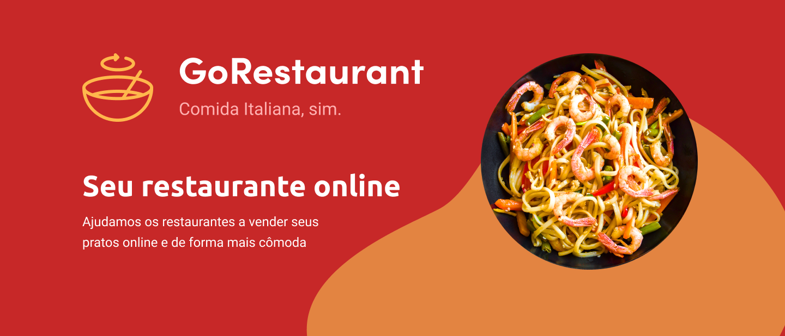
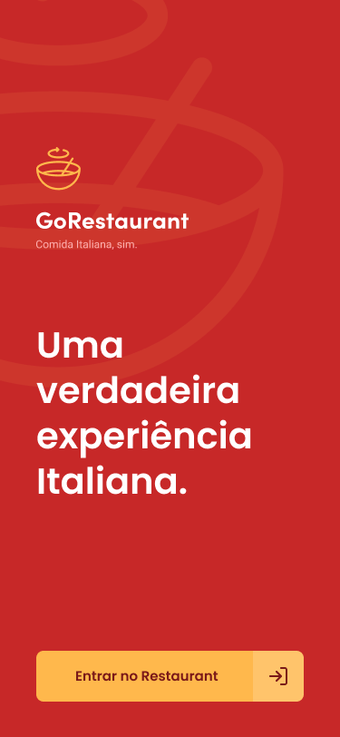
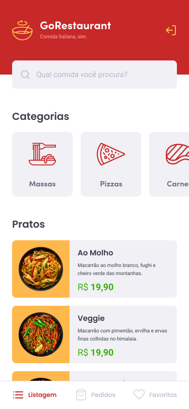
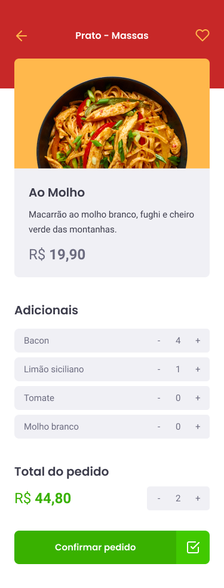
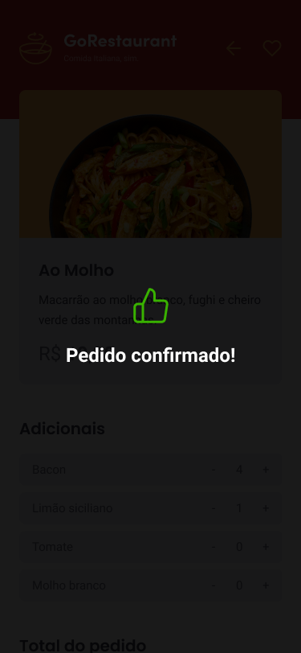

  

  

  

  

## :rocket: Technologies

This project was developed with the following technologies:

- [React-Native](https://reactnative.dev/)
- [Typescript](https://www.typescriptlang.org/)
- [Unform](https://github.com/Rocketseat/unform)
- [Styled-Componentes](https://styled-components.com/)
- [Jest](https://jestjs.io/)

## 💻 Project

This is an app for restaurant customers, it is possible to view and place orders.

  
  
  
  

## :memo: License

This project is under the MIT license. See the file [LICENSE](LICENSE) for more details.

## 🙏🏼 Acknowledgments

I want to thank [Rocketseat](https://github.com/Rocketseat) for devising and providing the basis for this project

---

Made with 💜 by Wesley Feitosa :wave:
